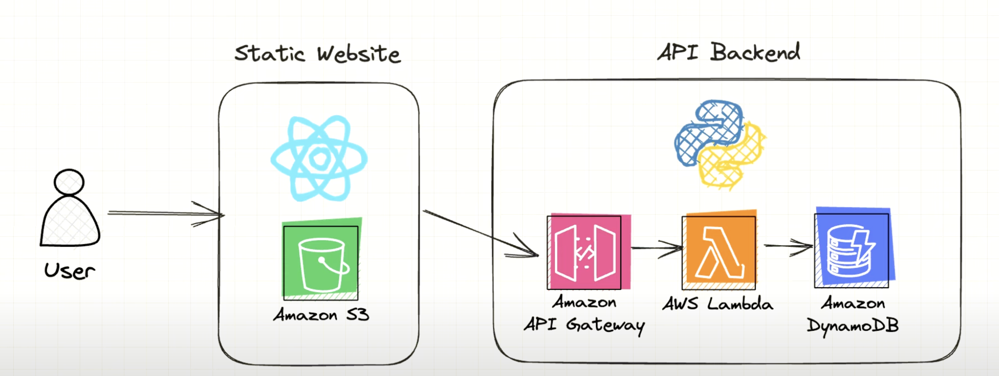

# AWS

## 1. Core Services

### 1.1 EC2 (Elastic Computer Cloud)

- Virtual servers (VMs) for running apps
- Use case: custom backends, cron jobs, etc.

### 1.2. Lambda

- Serverless functions. You write code, AWS handles the infrastructure
- Pay-per-invocation. Great for APIs, background jobs
- Run code in response to events (HTTP requests, file uploads, queues)
- Typically paired with API Gateway

### 1.3. S3 (Simple Storage Service)

- Object store (e.g., images, videos, backups)
- Versioning, lifecycle rules, and static website hosting
- Highly durable and scalable

### 1.4. RDS / Aurora

- Managed SQL databases (PostgreSQL, MySQ, etc)
- Auto backups, scaling, and failover support

### 1.5. DynamoDB

- Serverless NoSQL DB with ultra-low latency
- Greate for key-value or document use cases

### 1.6. API Gateway

- Define and expose REST/HTTP APIs
- Works great with Lambda for serverless APIs

### 1.7. CloudFront

- CDN to distribute your frontend, media, or API globally with low latency

### 1.8. Route 53

- DNS Service, domain registration, routing policies



## 2. Dev Essentials

- IAM (Identity & Access Management): Secure resources. Create roles, policies, and least privilige access
- VPC (Virtual Private Cloud): Network layering. Define subnets, firewalls (security groups), routing
- CloudWatch: Logging, metrics, and alarms. Monitor performance and errors
- Secrets manager / Parameter store: Securely store credentials, tokens, config
- CodePipeline + CodeBuild + CodedDeploy: CI/CD tools for automating deployment

One thing to be aware is AWS regions, you can select any region you want, but as you create services, they will be region-specific. For example:

- If you create an EC2 instance while in US East, this instance will "belong" to this region
- Therefore, each region will have its own separate set of resources

## 3. Per category

### 3.1 Compute

- EC2: VMS for full control over OS, runtime, or custom backend (e.g., running Strapi or a containerized Node.js app)
- Lambda: Run functions on demand without managing servers (e.g., process S3 file upload, webhooks, background jobs)

### 3.2 Storage

- S3: Store files, assets, backups (e.g., React static builds, user-uploaded images)
- EBS: Disk volumes attached to EC2 (e.g., app data or database storage)
- Glacier: Archival storage (e.g., old logs, compliance data)

### 3.3 Database

- RDS: Managed SQL (PostgreSQL, MySQL) with backups, replication (e.g., backend relational data)
- DynamoDB: Serverless NoSQL, fast key-value access (e.g., session storage, IoT data)
- Aurora: High-performance, scalable SQL (e.g., SaaS multi-tenant app)

### 3.4 Networking & Routing

- VPC: Private network for your resources (e.g., EC2 + RDS inside private subnets)
- Route 53: Domain registration and DNS routing (e.g., `api.example.com` -> API Gateway)
- Elastic Load Balancer: Distribute traffic to multiple EC2 instances or containers

### 3.5 Security

- IAM: Manage who/what can access resources (e.g., Lambda role to access S3)
- IAM Identity Center (SSO): Centralized login across AWS org/accounts
- Secrets manager: Store secrets securely (e.g., DB passwords for Lambda)
- Security Hub: Centralized security posture and threat detection

### 3.6 Monitoring & Logging

- CloudWatch: Logs, metrics, alarms (e.g., Lambda log output, CPU usage alerts)
- CloudTrail: Audit logs of all API activity (e.g. track "who deleted that bucket")
- X-Ray: Trace requests across services (e.g., identify slow DynamoDB queries)

### 3.7 DevOps and IaC (Infrastructure as Code)

- CloudFormation: Define infra in YAML/JSON templates (e.g., deploy full stack with networking)
- CDK: Code-first CloudFormation using TypeScript/Python (e.g., programmatic deployment of Lambda + API + DynamoDB)
- CodePipeline / CodeBuild: CI/CD pipelines (e.g., auto-deploy from GitHub to Lambda/EC2)

### 3.8 Data Integration & ETL (Extract, Transform, Load)

- Glue: ETL service for cleaning and transforming data at scale (e.g., convert CSVs in S3 to Parquet for Athena)
- Athena: Query S3 with SQL (e.g., analytics dashboard over log files)
- Kinesis: Real-time data streams (e.g., live analytics from user actions)

## 4. AWS Free tier

### Always Free

There are some services that are always free with monthly limits

- Lambda
- DynamoDB
- SQS
- CloudFront

### 12-Month Free

- EC2
- S3 Bucket (something like $1 store 50gb)
- RDS
- Amplify

## 5. How to use AWS

### 5.1 AWS Console

Web-based UI

- Use: manual setup, inspection, quick config, debugging
- Best for: beginners, visual exploration, chekcing logs, setting up minor things
- Not suitable for automation or repeatability

### 5.2 AWS CLI

Command-line tool (`aws <service> <command>`)

- Use: scripting, automation, deployments, quick tasks
- Best for: terminal-based workflows, CI/CD scripts, bulk operations
- E.g.,: `aws s3 cp file.txt s3://my-bucket/`

### 5.3 AWS SDKs (Software Development Kit)

Programmatic access via code (e.g., Node.js, Python, Go)

- Use: access AWS services from apps (e.g., upload to S3, query DynamoDB)
- Best for: dynamic or user-triggered operations in your codebase
- E.g.,: `s3Client.putObject({ Bucket, Key, Body })` in TS

### 5.4 AWS CDKs (Cloud Development Kit)

Infrastructure as Code using programming languages (TS, Python, YAML, etc)

- Use: define and deploy AWS infrastructure using code
- Best for: teams, projects needing repeatable, versioned, maintainable infra

```ts
new s3.Bucket(this, "MyBucket", { versioned: True });
```

## 6. Setup TypeScript SDK

1. Install SDK Packages

```bash
npm install @aws-sdk/client-s3 \
             @aws-sdk/client-dynamodb \
             @aws-sdk/client-lambda \
             @aws-sdk/client-cloudwatch-logs \
             @aws-sdk/client-rds-data
```

2. AWS SDK Client setup

```ts
// awsClient.ts
import { S3Client } from "@aws-sdk/client-s3";
import { DynamoDBClient } from "@aws-sdk/client-dynamodb";
import { LambdaClient } from "@aws-sdk/client-lambda";
import { CloudWatchLogsClient } from "@aws-sdk/client-cloudwatch-logs";
import { RDSDataClient } from "@aws-sdk/client-rds-data";

const REGION = "eu-central-1";

export const s3 = new S3Client({ region: REGION });
export const dynamo = new DynamoDBClient({ region: REGION });
export const lambda = new LambdaClient({ region: REGION });
export const logs = new CloudWatchLogsClient({ region: REGION });
export const rds = new RDSDataClient({ region: REGION });
```

3. Example usages

Check `exampleUsages.ts`

- Upload file to S3
- Write to DynamoDB
- InvokeLambda
- Write log to CloudWatch
- Query RDS (via Data API)

## 7. Setup Typescript CDK

Example with:

- S3 (frontend hosting)
- Lambda (API)
- API Gateway (routes)
- DynamoDB (data)

1. Init CDK Project

```bash
mkdir my-app && cd my-app
cdk init app --language=typescript # cdk is, btw, written in TS
npm install @aws-cdk/aws-s3 @aws-cdk/aws-lambda @aws-cdk/aws-apigateway \
            @aws-cdk/aws-dynamodb @aws-cdk/aws-iam
```

2. Create `lib/my-app-stack.ts`

```ts
import * as cdk from "aws-cdk-lib";
import { Construct } from "constructs";
import * as s3 from "aws-cdk-lib/aws-s3";
import * as lambda from "aws-cdk-lib/aws-lambda";
import * as apigateway from "aws-cdk-lib/aws-apigateway";
import * as dynamodb from "aws-cdk-lib/aws-dynamodb";

export class MyAppStack extends cdk.Stack {
  constructor(scope: Construct, id: string, props?: cdk.StackProps) {
    super(scope, id, props);

    // S3 (static frontend)
    const siteBucket = new s3.Bucket(this, "SiteBucket", {
      websiteIndexDocument: "index.html",
      publicReadAccess: true,
    });

    // DynamoDB table
    const table = new dynamodb.Table(this, "UsersTable", {
      partitionKey: { name: "userId", type: dynamodb.AttributeType.STRING },
      billingMode: dynamo.BillingMode.PAY_PER_REQUEST,
    });

    // Lambda function
    const apiFn = new lambda.Function(this, "ApiHandler", {
      runtime: lambda.Runtime.NODE_JS_X,
      handler: "index.handler",
      code: lambda.Code.fromAsset("lambda"), // folder with function code
      environment: {
        TABLE_NAME: table.tableName,
      },
    });

    // allow lambda to read/write DynamoDB
    table.grantReadWriteData(apiFn);

    new apigateway.LambdaRestApi(this, "ApiEndpoint", {
      handler: apiFn,
      proxy: true,
    });
  }
}
```

3. Create Lambda function

```js
//lambda/index.ts
exports.handler = async (event: any) => {
  return {
    statusCode: 200,
    body: JSON.stringify({ message: "Hello from lambda" }),
  };
};
```

4. Deploy

```bash
cdk bootstrap
cdk deploy
```
